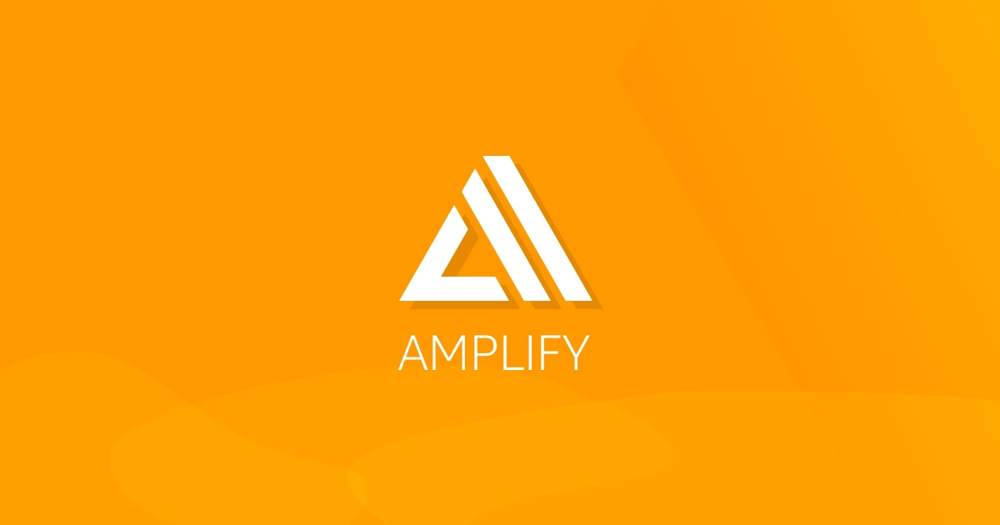
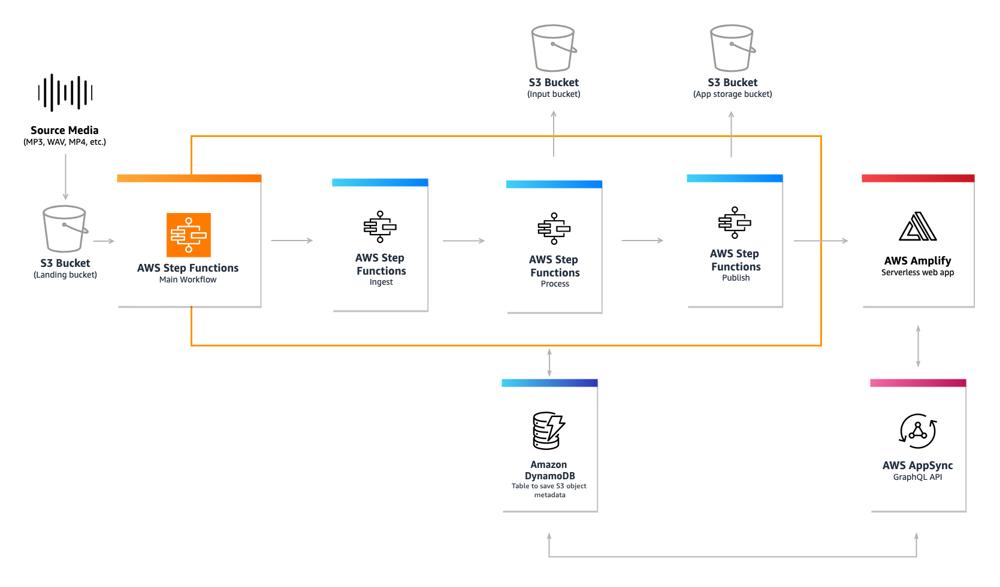
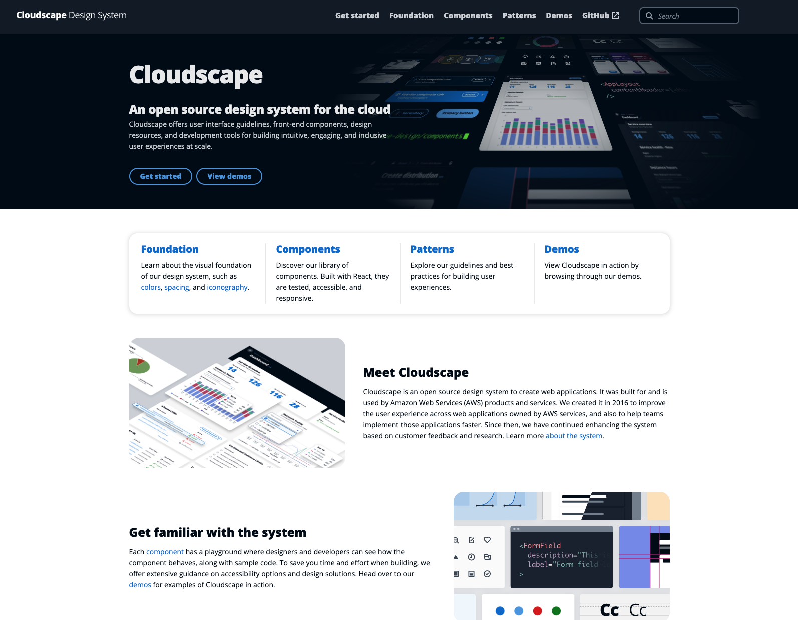
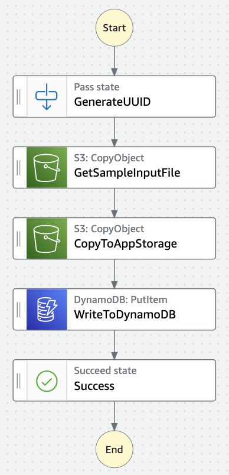

# Building Full-Stack React Web Applications with Cloudscape and AWS Amplify 🎉
#### Created by:
[Kevon Mayers](https://www.linkedin.com/in/kevonmayers)

This project is meant to serve as an example of have you can use Infrastructure as Code (IaC) with AWS Amplify for automated deployments at scale with multiple team members. To do this we are leveraging the **[AWS Amplify Libraries for JavaScript](https://docs.amplify.aws/lib/q/platform/js/)** - open-source client libraries that provide use-case centric, opinionated, declarative, and easy-to-use interfaces across different categories of cloud powered operations enabling mobile and web developers to easily interact with their backends.
Here are some of the things you can add to your app by using the client libraries:
- [Authentication](https://docs.amplify.aws/lib/auth/getting-started/q/platform/js/)
- [DataStore](https://docs.amplify.aws/lib/datastore/getting-started/q/platform/js/)
- [User File Storage](https://docs.amplify.aws/lib/storage/getting-started/q/platform/js/)
- [Geo](https://docs.amplify.aws/lib/geo/getting-started/q/platform/js/)
- [Serverless APIs](https://docs.amplify.aws/lib/graphqlapi/getting-started/q/platform/js/)
- [Analytics](https://docs.amplify.aws/lib/analytics/getting-started/q/platform/js/)
- [AI/ML](https://docs.amplify.aws/lib/predictions/getting-started/q/platform/js/)
- [PubSub](https://docs.amplify.aws/lib/pubsub/getting-started/q/platform/js/)
- [AR/VR](https://docs.amplify.aws/lib/xr/getting-started/q/platform/js/)

Sample data is ingested through the **Landing Zone S3 Bucket**, and can be ingested from any service within or connected to the AWS cloud. For the sake of this demo, example files are in the repo in the **`resources/sample-media`** directory.

## 🛠 What you will build

This is an event-driven architecture. An upload to the landing bucket sends the S3 Put operation log to Amazon EventBridge which then triggers the Step Function to run. As a sample, the Step Function simply adds a UUID to the object name, copies it the `sample_input_bucket` and the `sample_output_bucket`, and writes the S3 object metadata to DynamoDB. This however could be vastly expanded. For a more in-depth example, check out this blog for [integrating Amazon Transcribe Call Analytics into a Web Application](/TODO-MAKE-THIS-A-LINK).

By default, input data is restricted to audio/video file formats including **AMR, FLAC, MP3, MP4, Ogg, WebM, and WAV**. This is to serve as an example of how you can use [S3 bucket policies](https://docs.aws.amazon.com/AmazonS3/latest/userguide/using-iam-policies.html) to limit accidental executions of a Step Function. If you limit the bucket permissions to only allow file format types that you expect then you can prevent the Step Function from being accidentally triggered.
1. Amazon S3 provides a single landing zone for all ingested files. Data ingress to the **Landing Bucket** triggers the data pipeline.
2. **AWS Step Functions Workflow** orchestrates the data pipeline and requires no AWS Lambda functions, which can *vastly* reduce the complexity of deployment with **Infrastructure as Code**. There are many new [intrinsic functions](https://docs.aws.amazon.com/step-functions/latest/dg/amazon-states-language-intrinsic-functions.html) that enable you to transform your data in a number of ways, many of which previously would have required the use of Lambda functions. There is also [support for the AWS SDK](https://docs.aws.amazon.com/step-functions/latest/dg/supported-services-awssdk.html) which enables you to natively call AWS service API actions without the use of Lambda functions. See [this blog post](https://aws.amazon.com/blogs/compute/introducing-new-intrinsic-functions-for-aws-step-functions/) for more information on the new additions to intrinsic functions and [this blog post](https://docs.aws.amazon.com/step-functions/latest/dg/supported-services-awssdk.html) for information on the AWS SDK support.
3. **Amazon S3** provides data highly available and scalable object storage and **AWS DynamoDB** serves as the storage location for S3 Object metadata and is the data source for the **AWS AppSync GraphQL API**.
4. **AWS AppSync** provides a GraphQL API backend for integration with web applications and other data consumer applications, and **AWS Amplify** provides a serverless pre-configured management application that includes basic data browsing, data visualization, data uploader, and application configuration.

The Amplify App is leveraging [Cloudscape](https://cloudscape.design/) an open-source React component library released by AWS. If it looks familiar to you, it is because the AWS Console is built with it.

## AWS Service List
There are a number of AWS services used in this solution including:
- **[Amazon S3](https://aws.amazon.com/s3/)** - Data storage
- **[Amazon DynamoDB](https://aws.amazon.com/dynamodb/)** - Call transcription storage
- **[AWS AppSync](https://aws.amazon.com/appsync/)** - GraphQL API
- **[AWS Amplify](https://aws.amazon.com/amplify/)** - Full stack serverless web application
- **[AWS CodeCommit](https://aws.amazon.com/codecommit/)** - Git repository
- **[Amazon Cognito](https://aws.amazon.com/cognito/)** - Web app/API authentication/authorization
- **[Amazon EventBridge](https://aws.amazon.com/eventbridge/)** - Aggregation of notifications to trigger the Step Function
- **[Amazon IAM](https://aws.amazon.com/iam/)** - Security access control
- **[AWS Step Functions](https://aws.amazon.com/step-functions/)** - Low-code orchestration of data pipeline
- **[AWS Systems Manager Parameter Store](https://docs.aws.amazon.com/systems-manager/latest/userguide/systems-manager-parameter-store.html)** - secure, hierarchical storage for configuration data and secrets management

### Terraform and CDK

This solution can be deployed by leveraging **Terraform**. **AWS Cloud Development Kit (CDK)** support is coming in a future release. [Terraform](https://terraform.io) is an open-source infrastructure as code software tool created by [HashiCorp](https://www.hashicorp.com/). [AWS CDK](https://aws.amazon.com/cdk/) is an AWS native Infrastructure as Code tool that enables you to define your cloud application resources using familiar programming languages such as Python, TypeScript, etc. Our custom Terraform module **`sample-qs`** abstracts away the vast majority of the coding. Variables are available for use to dynamically customize your deployment. The custom CDK stacks serve the same purpose.

Please review the [Terraform Examples Documentation](terraform-deployment/examples/README.md) for examples to use for deployment. The `main.tf` file at `/terraform-deployment/main.tf` also comes preloaded with a sample deployment.

#### 🚀 Resources to be Deployed
**AWS Amplify**
- Web Application (Optional)
  - `sample-App`

**AWS AppSync**
- GraphQL API
  - `sample-graphql-api`

**AWS CodeCommit**
- Repository (Optional)
  - `sample_codecommit_repo`

**Amazon Cognito**
- `sample_user_pool`
- `sample_identity_pool`
- `sample_user_pool_client`
- `sample_admin_cognito_user_group`
- `sample_admin_cognito_users` (dynamic)
- `sample_standard_cognito_user_group`
- `sample_admin_cognito_users` (dynamic)

**Amazon DynamoDB**
- Table
  - `sample_output`

**Amazon EventBridge**
- Event Bus
  - `sample_event_bus`
- Event Rule
  - `default_event_bus_to_sample_event_bus`
  - `sample_landing_bucket_object_created`

**AWS IAM**
- Roles
  - `sample_amplify_codecommit`
  - `sample_appsync_dynamodb_restricted_access`
  - `sample_cognito_admin_group_restricted_access`
  - `sample_cognito_authrole_restricted_access`
  - `sample_cognito_standard_group_restricted_access`
  - `sample_cognito_unauthrole_restricted_access`
  - `sample_eventbridge_invoke_custom_sample_event_bus_restricted_access`
  - `sample_eventbridge_invoke_sfn_state_machine_restricted_access`
  - `sample_step_functions_master_restricted_access`
- Policies
  - `sample_s3_restricted_access_policy`
  - `sample_dynamodb_restricted_access_policy`
  - `sample_dynamodb_restricted_access_read_only_policy`
  - `sample_ssm_restricted_access_policy`
  - `sample_eventbridge_invoke_custom_sample_event_bus_restricted_access_policy`
  - `sample_eventbridge_invoke_sfn_state_machine_restricted_access_policy`
  - `sample_gitlab_mirroring_policy` (conditional)
- Users
  - `sample_gitlab_mirroring` (conditional)

**Amazon S3**
- Buckets
  - `sample_landing_bucket`
  - `sample_input_bucket`
  - `sample_output_bucket`
  - `sample_app_storage_bucket`

**AWS Systems Manager Parameter Store**
- SSM Parameter
  - `ssm_github_access_token` (conditional)
  - `sample_input_bucket_name`
  - `sample_output_bucket_name`
  - `sample_app_storage_bucket_name`
  - `sample_dynamodb_output_table_name`

**Step Functions**
- State Machine
  - `sample-state-machine`

### Data Pipeline

The data pipeline is an event-driven **AWS Step Functions Workflow** triggered by each upload to the **Landing S3 bucket**. Leveraging **Amazon EventBridge**, when a file matching the supported file type is uploaded to the Landing Bucket, the Step Functions Workflow will be triggered. The data pipeline performs the following functions:

1. **Data Ingestion**: The data will be ingested into the S3 Landing bucket. The landing bucket has a bucket policy that restricts file upload to certain specific file types that can be modified as you desire. This reduces the messages going to EventBridge as the EventBridge rule is set to only be used on **`S3:PutObject`** operations. If the file attempted to being uploaded is not a supported file type, the upload will fail and the notification will not be sent to EventBridge. This also means the Step Functions State Machine will not be invoked unless a supported file type is uploaded, reducing potential errors and the number of concurrent Step Functions State Machines running.

2. **Data Preparation**: If the file uploaded matches one of the supported file types, the S3 PutObject notifications will be sent to **EventBridge** and the **Step Function State Machine** will be invoked. The first step will fetch the file from the **S3 Landing bucket**, add a **UUID (Universally Unique Identifier)** to the object key (S3 file name), and copy the file to the Input bucket and App Storage bucket. For this simple example a UUID is not required, however we added it for extensibility - many S3 services you may want to integrate this with (Amazon Transcribe, Amazon Textract, etc.) require a unique ID for each job. The UUID being used is the **`id`** in the S3 PutObject log. This can also be used for **data lineage** because the same **`id`** present in the log for the original file upload will be in the file name as the file goes through the data pipeline.
3. **Data Processing**: Once the file is copied to the Input bucket with the generated UUID, and this is where you could extend this to other AWS services. Perhaps when you upload a file to S3 and it is copied to the input bucket with the necessary UUID, an Amazon Transcribe job is started. For now, the next step is just simulated and the file is copied on to the app storage bucket.
4. **Data Publishing**: If the file was successfully copied between the buckets, the original S3 object metadata will be written to theDynamoDB Table.

Review the [Step Function Workflow](resources/step-function/sample-step-function-workflow.png) for a visual aid.

**NOTE:** *To optimize costs, there is an [S3 Lifecycle Rule](https://docs.aws.amazon.com/AmazonS3/latest/userguide/object-lifecycle-mgmt.html) present on the **Landing Bucket**, and **Input Bucket**. By default, the rule will expire all objects in the buckets after 24 hours. The necessary data will still be retained however - the media file in the **App Storage Bucket** and the `JSON` data in the DynamoDB table. To modify this, you may disable or modify the lifecycle rules. They are accessible via [Terraform variables](https://www.terraform.io/language/values/variables). Additional costs may apply for removing these rules. For instructions, reference the [sample-qs module documentation](/terraform-deployment//modules/sample-qs/README.md).* If you want to leverage Quicksight, you can modify the Step Function to also copy the `JSON` data from the **Output Bucket** to the optional **Quicksight Bucket**. However, the sample web application has native dashboarding support by leveraging [Cloudscape Design Components](https://cloudscape.design/), so this is not enabled by default. See a demo of an example of an example dashboard [here](https://cloudscape.design/examples/react/dashboard.html?).

### AWS AppSync GraphQL API

A pre-built AWS **AppSync GraphQL API** provides flexible querying for application integration. This GraphQL API is authorized using **Amazon Cognito User Pools** and comes with predefined **Admin** and **Standard** roles. These roles are attached to the respective **Cognito User Pool Groups**. Users added to these groups will be able to assume the attached IAM role. This GraphQL API is used for integration with the **AWS Amplify Sample Web Application**.

### AWS Amplify Sample Web Application

An AWS Amplify application is deployed and hosted via Amazon Cloudfront and AWS Amplify. This is **enabled by default** as it is the intended use of this project, however, you can disable this and connect the backend resources to your own web application if you wish. For more information on the sample Amplify Application, see the [Sample Amplify App Documentation](/sample-sample-amplify-app/documentation/README.md)

### Sample Data Collection for Testing

This project comes with sample data for testing successful deployment of the application and can be found in the **`resources/sample-media`** directory.

## 💲 Cost and Licenses

You are responsible for the cost of the AWS services used while running this Quick Start reference deployment. There is no additional cost for using this Quick Start.

The custom Terraform module used for this Quick Start was includes configuration parameters that you can customize. Some of these settings can affect the cost of deployment. For cost estimates, see the pricing pages for each AWS service you use. Prices are subject to change.

**Tip:** After you deploy the Quick Start, create [AWS Cost and Usage Reports](https://docs.aws.amazon.com/cur/latest/userguide/what-is-cur.html) to track costs associated with the Quick Start. These reports deliver billing metrics to an S3 bucket in your account. They provide cost estimates based on usage throughout each month and aggregate the data at the end of the month. You can also use [AWS Budgets](https://aws.amazon.com/aws-cost-management/aws-budgets/) to set custom budgets to track your costs and usage, and respond quickly to alerts received from email or SNS notifications if you exceed your threshold. For more information, see [What are AWS Cost and Usage Reports?](https://docs.aws.amazon.com/cur/latest/userguide/what-is-cur.html) and the [AWS Budgets](https://aws.amazon.com/aws-cost-management/aws-budgets/) page.

This Quickstart doesn’t require any software license or AWS Marketplace subscription.

## How to Deploy - CHOOSE YOUR OWN ADVENTURE! 🚀

As mentioned earlier, you can deploy this sample project using either [Terraform]([terraform.io](https://www.terraform.io/)) or *(coming at a later date)* [AWS Cloud Development Kit (CDK)](https://aws.amazon.com/cdk/). We recommend use of VS Code and the AWS CLI. We also generally recommend a fresh AWS account that can be integrated with your existing infrastructure using AWS Organizations.

[Terraform Deployment Instructions](/terraform-deployment/README.md)
<!-- [AWS CDK Deployment Instructions](/cdk-deployment/README.md) -->

## 👀 See also

- [AWS Energy & Utilities](https://aws.amazon.com/energy/)

